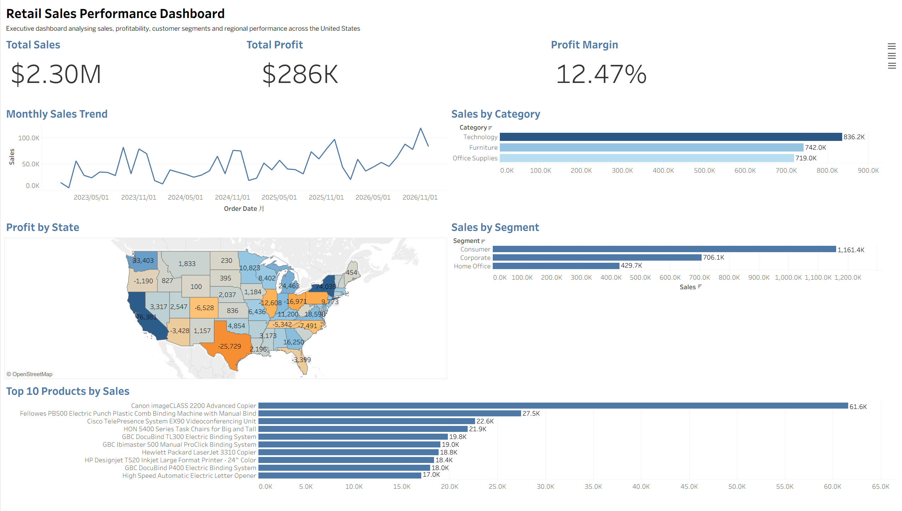

# Retail Sales Performance Dashboard


## Overview

This project presents an interactive Tableau dashboard analysing retail sales performance across the United States using the Sample Superstore dataset.

The dashboard provides an executive-level overview of sales, profitability, customer segments, product performance and regional performance to support business decision-making.

---

## Business Problem

Retail managers need a clear overview of business performance to answer questions such as:

- How much revenue and profit are generated?
- Which product categories perform best?
- Which customer segments contribute the most sales?
- Which states generate the highest and lowest profits?
- Which products generate the highest sales?

This dashboard helps answer these questions through interactive visualisations.

---

## Dashboard Preview



---

## Reports

[View Business Requirements Document](report/Business_Requirements_Document.pdf)

[View Executive Summary](report/Executive_Summary.pdf)

---

## Dashboard Features

- Executive KPI Cards
- Monthly Sales Trend
- Sales by Category
- Sales by Customer Segment
- Profit by State (Map)
- Top 10 Products by Sales

---

## Key Insights

- Total Sales reached **$2.30M**.
- Total Profit reached **$286K**, with a **12.47%** profit margin.
- Technology generated the highest sales among all product categories.
- Consumer customers contributed the highest share of revenue.
- California generated the highest profit, while Texas recorded the largest loss.
- Sales showed an overall upward trend throughout the reporting period.

---

## Business Recommendations

- Review pricing and discount strategies in low-profit states.
- Continue investing in Technology products.
- Prioritise Consumer customers while identifying growth opportunities in Home Office customers.
- Focus inventory planning on top-selling products.

---

## Tools Used

- Tableau
- Microsoft Excel

---

## Project Structure

```text
Retail-Sales-Performance-Dashboard
│
├── dashboard
├── data
├── images
├── report
└── README.md
```

---

## Dataset

Sample Superstore Dataset

## Skills Demonstrated

- Business Analysis
- KPI Design
- Dashboard Development
- Data Visualisation
- Executive Reporting
- Business Recommendation
